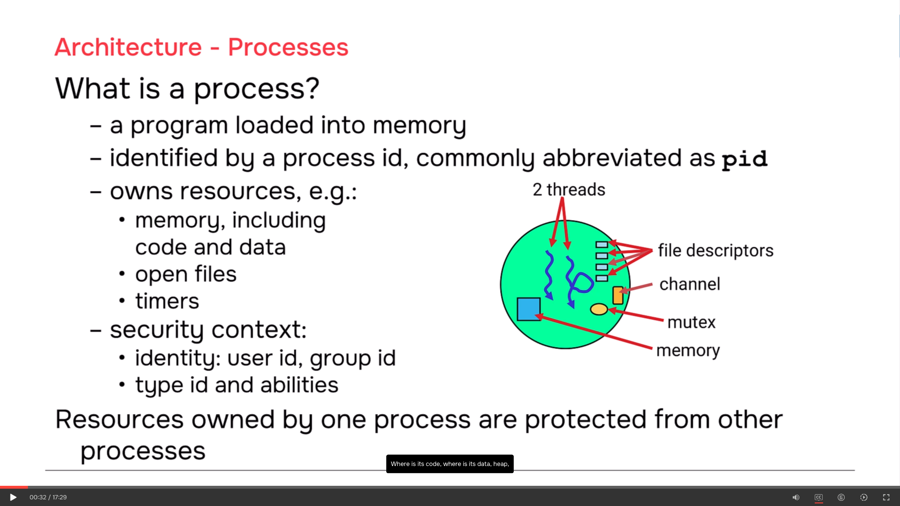
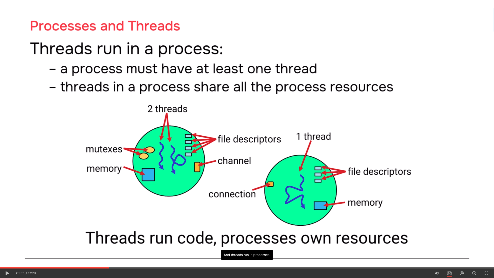
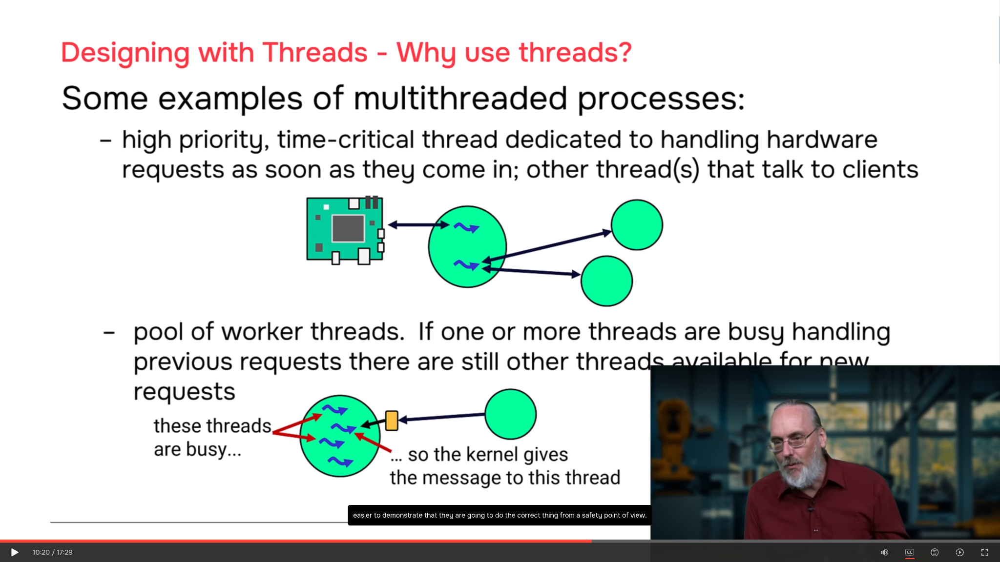
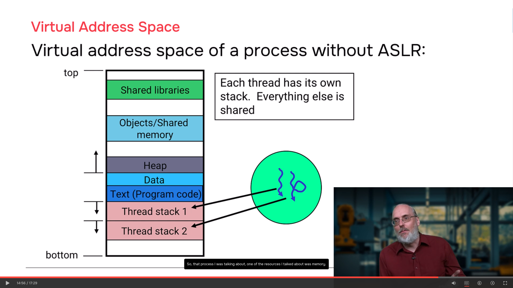

# QNX Processes, Threads & Virtual Address Space — Quick Study README

## Core Idea

This part explains three important QNX ideas:

```text
Process = owns resources + security context
Thread  = runs code inside a process
Virtual address space = protected memory view for each process
```

Golden sentence:

```text
Threads run code, processes own resources.
```

---

## 1. What Is a Process?

A **process** is a program loaded into memory and started.

It is identified by a:

```text
PID = Process ID
```

A process has two main jobs:

```text
1. Own resources
2. Provide a security context
```



A process owns resources such as:

```text
memory
code and data
open files
file descriptors
timers
channels
connections
mutexes
condition variables
```

A process also has a security context:

```text
identity:
    user ID
    group ID

type ID and abilities:
    what the process is allowed to do
```

Important idea:

```text
Resources owned by one process are protected from other processes.
```

---

## 2. Resource Ownership Means Two Things

### 1. Protection

One process cannot directly damage another process memory.

```text
Process A memory
    is protected from
Process B
```

### 2. Cleanup

When a process exits or crashes, QNX cleans up the resources owned by that process.

```text
process dies
    |
    v
owned resources are cleaned up
```

---

## 3. What Is a Thread?

A **thread** is the execution path inside a process.

The thread is the thing that actually runs instructions on the CPU.

```text
Process = container
Thread  = execution flow
```

A process must have at least one thread.

If the last thread exits, the process exits too.

---

## 4. Threads Share Process Resources

Threads inside the same process share the process resources.



Example:

```text
Thread 1 opens a file
Thread 2 can read/write that file
Thread 3 can close that file
```

Another example:

```text
Thread 1 allocates memory
Thread 2 modifies that memory
Thread 3 frees that memory
```

So:

```text
Threads in the same process share:
    memory
    heap
    globals
    file descriptors
    channels
    mutexes
```

But each thread has its own:

```text
stack
register context
priority
scheduling state
```

---

## 5. Why Synchronization Is Needed

Because threads share resources, they can conflict.

Example race condition:

```text
counter = 5

Thread A reads counter = 5
Thread B reads counter = 5
Thread A writes counter = 6
Thread B writes counter = 6

Expected result = 7
Actual result   = 6
```

To avoid this, use synchronization:

```text
mutex
condition variable
semaphore
join
```

Key idea:

```text
Shared resources need synchronization.
```

---

## 6. When Should You Use Multiple Threads?

Single-threaded processes are easier:

```text
easier to write
easier to debug
easier to test
more predictable
better for safety reasoning
```

Use multiple threads when:

```text
you need to start new work before old work finishes
```



Example 1: Driver

```text
Thread 1:
    handles client requests

Thread 2:
    high-priority thread handles hardware interrupts/events
```

Why?

```text
A client request may take 1 ms
but hardware may need response within 200 us
```

So the hardware thread should have higher priority and preempt the client thread.

---

## 7. Worker Thread Pool

Another use case is a pool of worker threads.

Example: filesystem process

```text
Low-priority client:
    read 20 MB image

High-priority client:
    write 20-byte critical log
```

With one thread, the critical log may wait too long.

With a worker pool:

```text
one thread handles the long request
another thread handles the urgent request
```

On multicore systems, they may even run in parallel.

---

## 8. Process vs Thread Design Rule

Use separate **processes** when components have:

```text
different resources
different code/data
different hardware
different security needs
need fault isolation
```

Use multiple **threads** when one process needs:

```text
concurrent execution
shared resources
urgent work before old work finishes
```

Short rule:

```text
Processes are for separation.
Threads are for concurrency inside one process.
```

---

## 9. Virtual Address Space

QNX uses **virtual addresses**.

A process does not directly use physical RAM addresses.

Instead:

```text
Process uses virtual address
        |
        v
MMU translates it
        |
        v
Physical RAM address
```



Important:

```text
Each process has its own virtual address space.
```

This gives:

```text
memory protection
process isolation
clean memory organization
```

---

## 10. Process Memory Layout

A process virtual address space contains blocks such as:

```text
thread stacks
text/program code
data
heap
objects/shared memory
shared libraries
```

### Thread stacks

Each thread has its own stack.

```text
Thread 1 -> stack 1
Thread 2 -> stack 2
```

### Text / Program code

This is the executable code.

Usually read-only.

### Data

Global and static variables.

### Heap

Dynamic memory from:

```c
malloc();
calloc();
new;
```

### Shared memory

Explicitly shared memory mappings between processes.

### Shared libraries

Libraries loaded into the process, such as:

```text
libc.so
libgcc.so
ldqnx.so
```

---

## 11. Important Virtual Memory Rule

The same virtual address in two different processes does **not** mean the same physical memory.

```text
Process A:
    virtual 0x1000 -> physical 0x80001000

Process B:
    virtual 0x1000 -> physical 0x90005000
```

So do not send a normal pointer from one process to another and expect it to work.

Wrong idea:

```text
Process A sends pointer 0x50000000 to Process B
Process B uses it directly
```

Correct options:

```text
send data using IPC/message passing
or use explicit shared memory
```

---

## 12. ASLR

`ASLR` means:

```text
Address Space Layout Randomization
```

It randomizes where memory regions appear in the virtual address space.

Without ASLR:

```text
layout is mostly fixed
```

With ASLR:

```text
stack, heap, libraries, and other regions may move each run
```

Security benefit:

```text
harder for attackers to guess useful memory addresses
```

Safety consideration:

```text
random layout may reduce determinism
so safety systems must decide carefully
```

---

## 13. Common Quiz Questions

### Q1: What is a process?

```text
A program loaded into memory and running, identified by a PID.
```

### Q2: What are the two main roles of a process?

```text
Own resources
Provide security context
```

### Q3: What does a thread do?

```text
Runs code inside a process.
```

### Q4: What must every process have?

```text
At least one thread.
```

### Q5: What do threads in the same process share?

```text
Process resources such as memory, file descriptors, channels, heap, and globals.
```

### Q6: Why use multiple threads?

```text
To start new work before old work finishes.
```

### Q7: What is virtual address space?

```text
A protected memory view that each process uses instead of direct physical memory.
```

### Q8: Does the same virtual address in two processes mean the same memory?

```text
No.
```

### Q9: What is ASLR?

```text
Address Space Layout Randomization.
It randomizes memory layout for better security.
```

---

## Final Summary

```text
Process:
    owns resources and security context

Thread:
    executes code inside process

Multiple threads:
    share process resources and need synchronization

Virtual address space:
    gives each process protected memory

ASLR:
    randomizes memory layout for security
```

Final key sentence:

```text
In QNX, processes protect resources, threads execute work, and virtual memory isolates each process.
```
