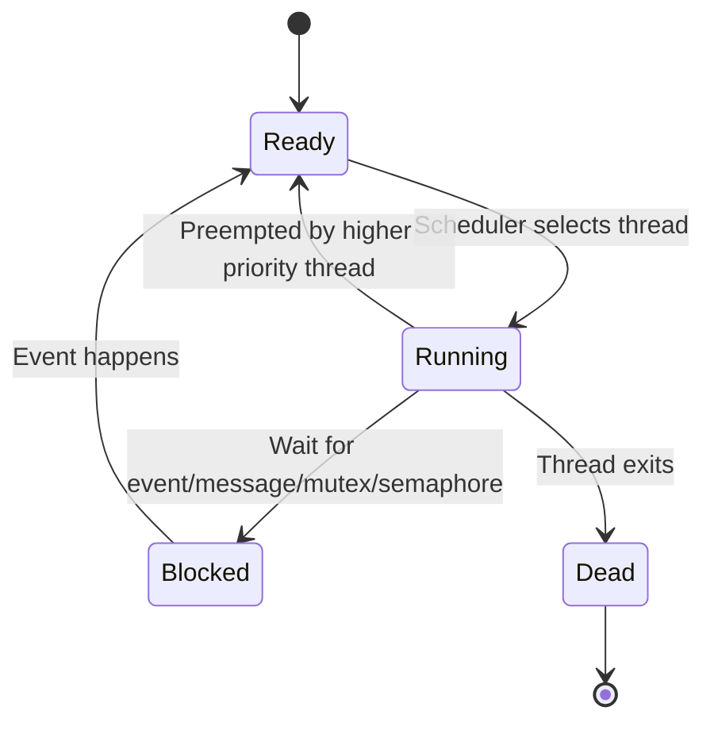
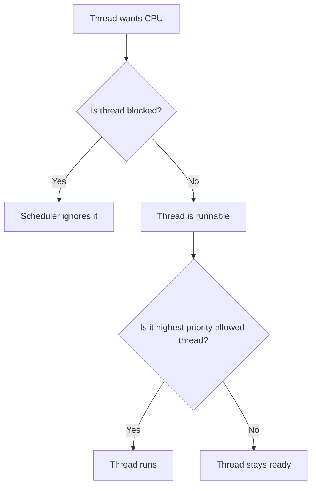
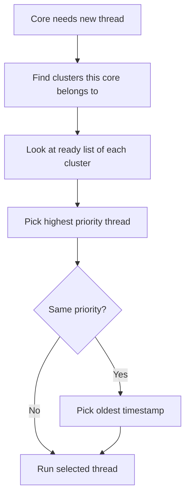
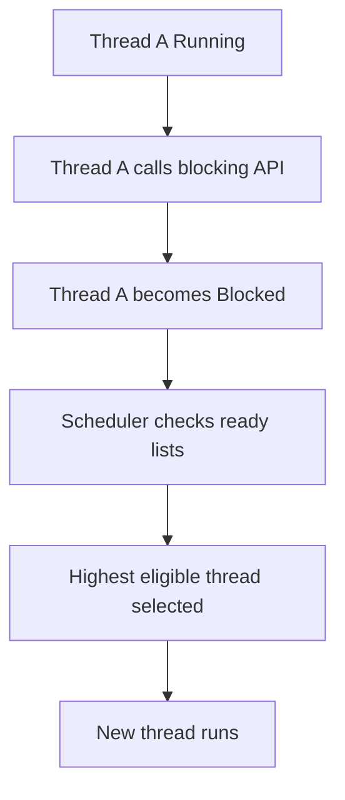
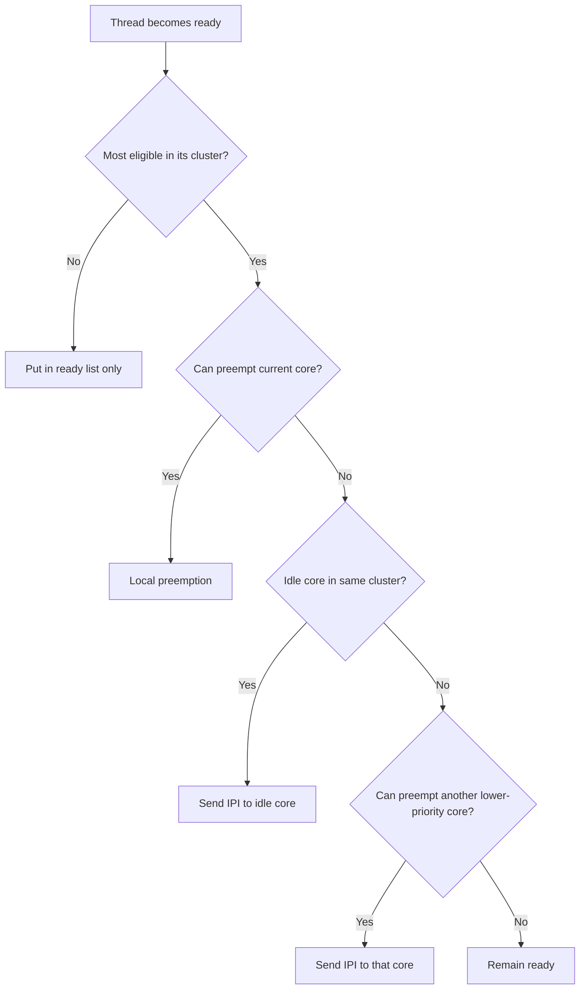
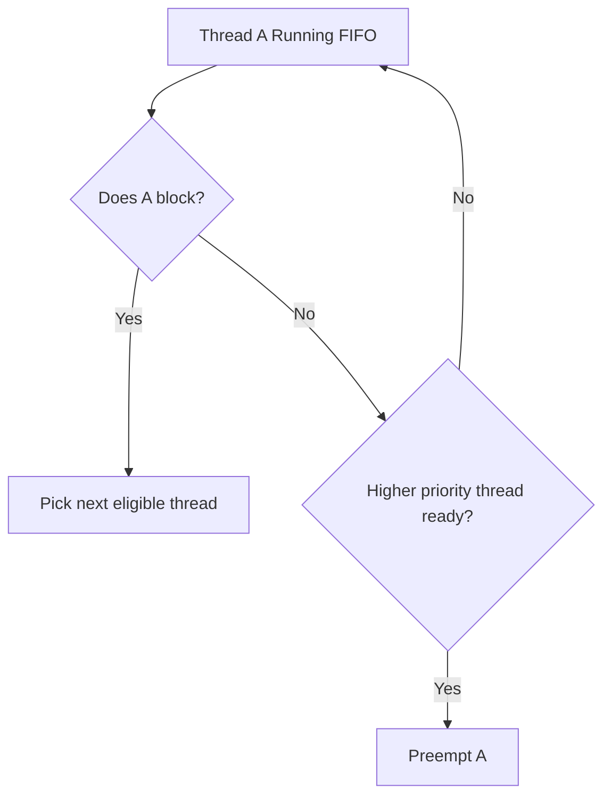
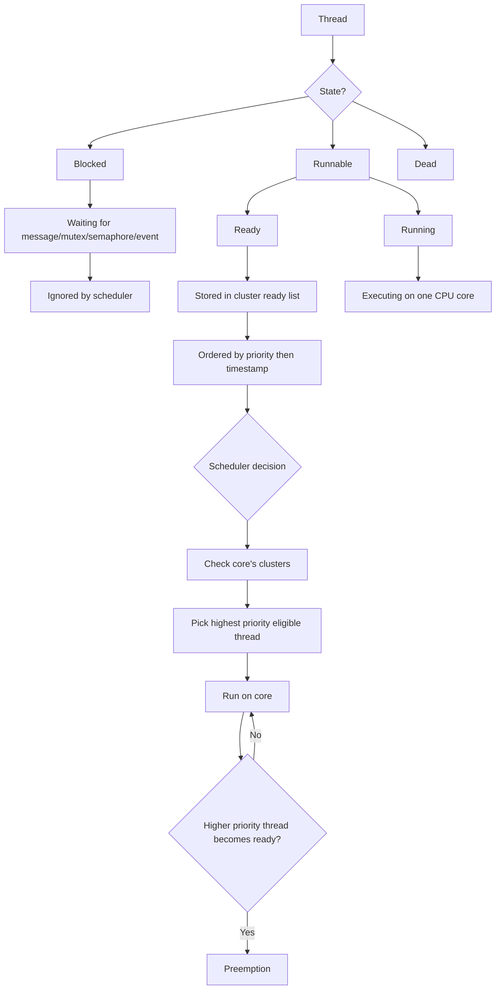

# QNX Runtime Scheduling — Study Notes

These notes explain the QNX scheduling section in a simple way, based on the course script and our step-by-step discussion.

---

# 1. Main Idea

QNX does **scheduling for threads**, not processes.

A process is only a container for resources like memory, file descriptors, and address space.

The real execution unit is the **thread**.

```text
Process
 ├── Thread 1
 ├── Thread 2
 └── Thread 3
```

The scheduler does not say:

```text
Run Process A
```

It says:

```text
Run Thread X
```

So in QNX:

```text
Scheduled entity = Thread
Not Process
```

---

# 2. Thread States

A thread can be in different states.

The two main scheduling-related states are:

```text
Thread
 ├── Blocked
 └── Runnable
```

---

## 2.1 Blocked Thread

A blocked thread is waiting for something.

Examples:

```text
Waiting for message
Waiting for reply
Waiting for mutex
Waiting for semaphore
Waiting for condition variable
Waiting for signal
Waiting for interrupt/event
```

Example:

```c
MsgReceive(...);
```

This means the thread says to the kernel:

```text
I want to wait until a message arrives.
```

While the thread is blocked, the scheduler ignores it.

```text
Blocked thread = Not eligible for CPU
```

---

## 2.2 Runnable Thread

A runnable thread is ready to use the CPU.

Runnable threads are divided into:

```text
Runnable
 ├── Running
 └── Ready
```

---

## 2.3 Running Thread

A running thread is currently executing on a CPU core.

Example on 4 cores:

```text
Core 0 → Running Thread A
Core 1 → Running Thread B
Core 2 → Running Thread C
Core 3 → Running Thread D
```

Normally:

```text
Number of running threads ≈ Number of CPU cores
```

---

## 2.4 Ready Thread

A ready thread wants to run, but it is waiting because another thread is currently using the CPU.

Example on one core:

```text
Core 0 → Thread A is Running

Ready list:
    Thread B
    Thread C
    Thread D
```

So:

```text
Ready = can run, but not selected yet
Running = selected and executing now
```

---

## 2.5 Dead Thread

A dead thread has terminated, but the system has not fully cleaned it up yet.

Important:

```text
Dead thread can never run again.
```

---

# 3. Thread State Diagram



---

# 4. Priority in QNX

Each thread has a priority.

QNX priority range:

```text
0   → Lowest priority
255 → Highest priority
```

But some priorities are reserved.

```text
Priority 0       → Idle threads
Priority 254     → Kernel interrupt/timer service threads
Priority 255     → IPI interrupt service threads
User threads     → Usually between 1 and 253
```

---

## 4.1 Idle Thread

Each core has its own idle thread.

Example:

```text
Core 0 → Idle Thread
Core 1 → Idle Thread
Core 2 → Idle Thread
Core 3 → Idle Thread
```

The idle thread runs only when there is no real work to do.

```text
If no runnable thread exists for a core,
the idle thread runs.
```

---

## 4.2 Priority Applies Only to Runnable Threads

A high-priority blocked thread does not run.

Example:

```text
Thread A → Priority 100 → Blocked
Thread B → Priority 20  → Runnable
```

Result:

```text
Thread B runs.
```

Why?

Because Thread A is blocked, so the scheduler ignores it.

---

# 5. Processes Do Not Really Have Priority

In QNX, priority belongs to threads.

A process itself does not really have a scheduling priority.

When we say:

```text
Start this process at priority 20
```

The real meaning is:

```text
Start the first thread inside this process at priority 20.
```

Example:

```text
Process: EthernetApp
 ├── RX Thread       Priority 30
 ├── TX Thread       Priority 25
 └── Logging Thread  Priority 10
```

The scheduler chooses between the threads, not the process.

---

# 6. Preemptive Scheduling

QNX uses **priority-driven preemptive scheduling**.

Meaning:

```text
Higher-priority runnable thread runs before lower-priority runnable thread.
```

Example:

```text
Thread A → Priority 10 → Running
Thread B → Priority 30 → Becomes Runnable
```

Thread B has higher priority, so QNX does this:

```text
Thread A → Ready
Thread B → Running
```

This is called:

```text
Preemption
```

---

## 6.1 QNX Is Not Fair-Share

QNX does not split CPU like this:

```text
Priority 20 → 70% CPU
Priority 10 → 30% CPU
```

Instead:

```text
Higher priority wins.
```

Even a small priority difference matters.

```text
Priority 11 beats Priority 10
Priority 21 beats Priority 10
Priority 200 beats Priority 10
```

If the higher-priority thread is runnable, it runs.

---

# 7. Good QNX Thread Design

Because higher priority wins, a high-priority thread must not stay runnable all the time.

Bad design:

```c
while (1)
{
    check_sensor();
}
```

This is polling or busy looping.

Problem:

```text
The thread keeps using CPU.
Lower-priority threads may never run.
```

Good design:

```c
while (1)
{
    wait_for_event();

    handle_event();
}
```

The thread should:

```text
1. Block while there is no work
2. Wake up when an event happens
3. Handle the work quickly
4. Block again
```

---

## 7.1 Typical QNX Server Thread

```c
while (1)
{
    MsgReceive(...);

    handle_message();
}
```

`MsgReceive()` blocks until a message arrives.

While blocked, the thread does not consume CPU.

---

# 8. Basic Scheduling Flow



---

# 9. Multicore and SMP

QNX supports multicore systems.

A multicore system has more than one CPU core.

Example:

```text
Core 0
Core 1
Core 2
Core 3
```

Normally, each core can run one thread at a time.

---

## 9.1 SMP Meaning

SMP means:

```text
Symmetrical Multiprocessing
```

It means the cores are treated as equivalent.

From the scheduler point of view:

```text
Core 0 = Core 1 = Core 2 = Core 3
```

In QNX, you may see a kernel name like:

```text
procnto-smp
```

Meaning:

```text
QNX kernel with SMP/multicore support
```

---

## 9.2 SMP Instrumented Kernel

You may also see:

```text
procnto-smp-instr
```

Breakdown:

```text
procnto → QNX microkernel + process manager
smp     → Supports SMP/multicore systems
instr   → Instrumented kernel
```

Instrumented means the kernel has tracing/profiling support.

It can help you analyze:

```text
Context switches
Thread blocking/unblocking
Thread readiness
Scheduling events
Interrupt-related events
Message-passing activity
```

The scheduling logic is still the same idea:

```text
Higher-priority runnable threads preempt lower-priority runnable threads.
```

The difference is that the instrumented kernel gives better visibility for debugging and real-time analysis.

---

## 9.3 Real Hardware Is Not Always Symmetric

Modern hardware may not be perfectly symmetric.

Examples:

```text
Some cores are faster.
Some cores use less power.
Some cores share cache.
Some cores have special hardware registers.
Some cores are assigned for safety-critical work.
```

Example cache layout:

```text
Cores 0,1,2,3 share L3 cache
Cores 4,5,6,7 share L3 cache
```

If two threads share a lot of data, it may be better to run them on cores that share cache.

---

# 10. Core Affinity

Core affinity means:

```text
Limit a thread to run only on specific cores.
```

Example:

```text
Thread A → Core 0 only
Thread B → Core 0 or Core 1
Thread C → Core 2 or Core 3
```

This is useful for:

```text
Safety separation
Performance cores
Low-power cores
Hypervisor separation
Cache efficiency
Core-specific hardware
```

---

# 11. Why QNX Uses Clusters

QNX needs scheduling to be fast and predictable.

A real-time OS must avoid scheduling algorithms where the cost increases badly when the number of threads increases.

---

## 11.1 Problem with One Global Ready Queue

Simple idea:

```text
Put all ready threads in one global queue.
```

Problem with core affinity:

```text
Core 4 wants a thread.
There are 80 ready threads.
Most of them are not allowed on Core 4.
Scheduler may need to search many threads.
```

Bad for real-time predictability.

---

## 11.2 Problem with Per-Core Queues

Another idea:

```text
Each core has its own ready queue.
```

Problem:

```text
Load balancing becomes difficult.
A thread may be ready on Core 0 queue,
but Core 1 may become free.
```

Moving work between core queues becomes messy.

---

# 12. QNX Solution: Cluster-Based Scheduling

A cluster is:

```text
A group of related CPU cores.
```

Example:

```text
Cluster A = Core 0 + Core 1
Cluster B = Core 2 + Core 3
```

Diagram:

```text
System with 4 cores

+-------------------+       +-------------------+
| Cluster A         |       | Cluster B         |
|                   |       |                   |
| Core 0   Core 1   |       | Core 2   Core 3   |
+-------------------+       +-------------------+
```

A thread belongs to one cluster.

```text
Ready thread  → belongs to one cluster
Running thread → runs on one specific core
```

---

# 13. Ready Lists Are Per Cluster

Instead of one global ready queue, QNX tracks ready threads per cluster.

```text
Cluster A Ready List:
    Thread X Priority 50
    Thread Y Priority 30

Cluster B Ready List:
    Thread Z Priority 40
    Thread W Priority 20
```

Each cluster ready list is ordered by:

```text
1. Priority
2. Timestamp
```

Priority first.

If same priority, the older timestamp wins.

---

# 14. Cluster Scheduling Diagram



---

# 15. Default Clusters

QNX always has at least two kinds of clusters.

---

## 15.1 All-Cores Cluster

This cluster contains all CPU cores.

Example:

```text
All cluster = Core 0 + Core 1 + Core 2 + Core 3
```

A thread in this cluster may run on any core.

---

## 15.2 Per-Core Cluster

Each core also has its own cluster.

Example:

```text
Core 0 cluster = Core 0 only
Core 1 cluster = Core 1 only
Core 2 cluster = Core 2 only
Core 3 cluster = Core 3 only
```

These are used for core-specific threads like:

```text
Idle thread
IPI thread
Clock/timer thread
```

---

## 15.3 Each Core Belongs to at Least Two Clusters

Example for Core 2:

```text
Core 2 belongs to:
    1. All-cores cluster
    2. Core 2 only cluster
```

Startup code can add more clusters.

---

# 16. Who Defines Clusters?

Clusters are defined in the BSP startup code.

BSP means:

```text
Board Support Package
```

This makes sense because clusters depend on hardware design.

Examples:

```text
Which cores share cache?
Which cores are high performance?
Which cores are low power?
Which cores are safety-related?
Which cores are for hypervisor use?
```

The cluster configuration is fixed during runtime.

That helps QNX keep scheduling cost predictable.

---

# 17. Cluster Rules

Important rules:

```text
Each cluster must be unique.
A core can belong to a maximum of 8 clusters.
```

Since each core already belongs to:

```text
1. All-cores cluster
2. Per-core cluster
```

Startup can add up to 6 more clusters per core.

If this limit is exceeded, startup can fail.

---

# 18. Cluster Definition Using Startup Option

QNX startup supports `-c` to define clusters.

Example:

```text
startup-boardname -c cluster0:0x7,cluster1:0x9
```

Each cluster has:

```text
name:bitmask
```

---

## 18.1 Understanding `0x7`

```text
0x7 = binary 0111
```

Bits:

```text
bit 0 = Core 0
bit 1 = Core 1
bit 2 = Core 2
bit 3 = Core 3
```

So:

```text
0111 = Core 0 + Core 1 + Core 2
```

Therefore:

```text
cluster0:0x7 means cluster0 contains cores 0,1,2
```

---

## 18.2 Understanding `0x9`

```text
0x9 = binary 1001
```

Bits:

```text
bit 0 = 1 → Core 0
bit 1 = 0 → Core 1 not included
bit 2 = 0 → Core 2 not included
bit 3 = 1 → Core 3
```

Therefore:

```text
cluster1:0x9 means cluster1 contains cores 0 and 3
```

---

# 19. Mask Cheat Sheet

```text
0x1 = 0001 → Core 0
0x2 = 0010 → Core 1
0x4 = 0100 → Core 2
0x8 = 1000 → Core 3

0x3 = 0011 → Core 0 + Core 1
0x7 = 0111 → Core 0 + Core 1 + Core 2
0x9 = 1001 → Core 0 + Core 3
0xF = 1111 → Core 0 + Core 1 + Core 2 + Core 3
```

For 8 cores:

```text
0x0F = 00001111 → Cores 0,1,2,3
0xF0 = 11110000 → Cores 4,5,6,7
```

---

# 20. Viewing Clusters

Command:

```sh
pidin syspage=cluster
```

This shows additional clusters configured in the system.

The default clusters may not be shown because they are always known.

---

# 21. Scheduling with Clusters

When a core needs a new thread:

```text
1. The core knows which clusters it belongs to.
2. It checks the ready lists of those clusters.
3. It chooses the most eligible thread.
```

Most eligible means:

```text
Highest priority
Then oldest timestamp
```

---

## 21.1 Example

```text
Core 0 belongs to:
    All cluster
    Core 0 only cluster
    Cluster A
```

Ready lists:

```text
All cluster:
    Thread X Priority 20

Core 0 cluster:
    Idle Thread Priority 0

Cluster A:
    Thread Y Priority 50
    Thread Z Priority 50 but older timestamp
```

Result:

```text
Thread Z runs on Core 0
```

Why?

Because Thread Z and Thread Y have the highest priority, but Thread Z has the older timestamp.

---

# 22. When a Running Thread Blocks

This is the easy scheduling case.

Example:

```text
Core 0 is running Thread A.
Thread A calls MsgReceive().
Thread A becomes blocked.
```

Then QNX:

```text
1. Removes Thread A from running state
2. Looks at ready threads for Core 0
3. Picks the best ready thread
4. Runs it on Core 0
```

Diagram:



---

# 23. When a Blocked Thread Becomes Ready

Example:

```text
Thread B was blocked on semaphore.
Another thread calls sem_post().
Thread B becomes ready.
```

Now QNX checks:

```text
Is Thread B the most eligible thread in its cluster?
```

If no:

```text
Put it in ready list and continue.
```

If yes:

```text
Can it preempt current core?
If yes, do local preemption.
If no, check another core in its cluster.
```

---

## 23.1 Ready Thread Decision Flow



---

# 24. IPI

IPI means:

```text
Inter-Processor Interrupt
```

It is an interrupt from one core to another.

Example:

```text
Core 0 notices that Thread B became ready.
Thread B should run on Core 2.
Core 2 is idle.
Core 0 sends IPI to Core 2.
Core 2 runs the scheduler and starts Thread B.
```

IPI threads have very high priority because they are part of kernel coordination between cores.

---

# 25. Core Affinity with ThreadCtl

To set a thread’s allowed cores, QNX uses:

```c
ThreadCtl(_NTO_TCTL_RUNMASK, ...);
```

The runmask is a bitmask.

Each bit represents a core.

```text
bit 0 → Core 0
bit 1 → Core 1
bit 2 → Core 2
bit 3 → Core 3
...
```

---

## 25.1 Important Rule

The runmask must match an existing cluster.

Example:

```text
runmask = 0x9
```

This means:

```text
Core 0 + Core 3
```

This only succeeds if the system has a cluster exactly containing Core 0 and Core 3.

If no matching cluster exists:

```text
ThreadCtl() fails.
```

---

## 25.2 Example Code

```c
#include <sys/neutrino.h>   /* Include QNX ThreadCtl API. */
#include <stdint.h>         /* Include uint64_t type. */
#include <stdio.h>          /* Include printf function. */
#include <errno.h>          /* Include errno variable. */
#include <string.h>         /* Include strerror function. */

int main(void)
{
    uint64_t runmask = 0x9;  /* Allow this thread to run on Core 0 and Core 3. */

    if (ThreadCtl(_NTO_TCTL_RUNMASK, (void *)runmask) == -1)
    {
        printf("ThreadCtl failed: %s\n", strerror(errno));  /* Print the error reason. */
        return 1;                                           /* Return error code. */
    }

    printf("Runmask set successfully\n");  /* Print success message. */

    while (1)
    {
        /* Do the thread work here. */
    }

    return 0;  /* Return success code. */
}
```

Important detail:

```c
(void *)runmask
```

QNX passes the runmask value directly as the second parameter.

It does not pass:

```c
&runmask
```

---

# 26. Why Use Core Affinity?

## 26.1 Performance

```text
High-performance thread → Big cores
Background thread       → Low-power cores
```

---

## 26.2 Safety Separation

Automotive example:

```text
ASIL threads → Cores 4,5,6,7
QM threads   → Cores 0,1,2,3
```

---

## 26.3 Hypervisor Separation

```text
Hypervisor-related work → Cores 0,1
Normal application work → Cores 2,3
```

---

## 26.4 Cache Efficiency

Threads that share data can run on cores that share cache.

```text
Thread A produces data
Thread B consumes data
```

Better placement can improve cache behavior.

---

## 26.5 Core-Specific Hardware

Some registers or hardware features may exist only on specific cores.

In this case, the thread should be bound to that core.

---

# 27. Scheduling Algorithms

Each thread has:

```text
1. Priority
2. Scheduling algorithm
```

The main algorithms discussed are:

```text
FIFO
Round Robin
Sporadic
High Priority IST
```

The algorithm is secondary to priority.

Priority still decides who wins first.

---

# 28. FIFO Scheduling

FIFO means:

```text
First In, First Out
```

In QNX scheduling, FIFO means:

```text
A thread keeps running until it blocks,
or until a higher-priority thread preempts it.
```

Example:

```text
Thread A Priority 30 FIFO
Thread B Priority 30 FIFO
```

If Thread A is running, Thread B does not automatically get CPU just because it has the same priority.

Thread A keeps running until:

```text
It blocks
It exits
A higher-priority thread preempts it
```

---

## 28.1 FIFO Diagram



---

# 29. Round Robin Scheduling

Round Robin is similar to FIFO, but it adds a time slice.

If multiple threads have the same priority, they take turns.

Example:

```text
Thread A Priority 40 RR
Thread B Priority 40 RR
Thread C Priority 40 RR
```

On one core:

```text
A → B → C → A → B → C
```

Each thread runs for a time slice.

---

## 29.1 Round Robin on One Core

```text
Ready list:

A → B → C

After A time slice:
B → C → A

After B time slice:
C → A → B
```

---

## 29.2 Round Robin Does Not Beat Priority

Round Robin only shares CPU between threads of the same priority.

Example:

```text
Thread A Priority 40 RR
Thread B Priority 40 RR
Thread C Priority 60 FIFO
```

If Thread C becomes runnable:

```text
Thread C preempts A or B immediately.
```

Priority wins first.

---

## 29.3 Preempted Time Does Not Count

Example:

```text
Thread A Priority 40 RR
Time slice = 4 ms
```

Thread A runs for 2 ms.

Then:

```text
Thread F Priority 50 becomes runnable.
Thread F preempts Thread A for 2 ms.
```

When Thread A runs again:

```text
Thread A still has 2 ms left from its time slice.
```

Because preempted time is not counted as CPU time used by Thread A.

---

# 30. Round Robin on Multicore

On one core, Round Robin is simple:

```text
A → B → C → A → B → C
```

On multiple cores, it becomes more complex.

Example:

```text
Cluster = Core 1 + Core 2

Thread A Priority 40 RR
Thread B Priority 40 RR
Thread C Priority 40 RR
```

Possible behavior:

```text
Core 1 runs A
Core 2 runs B
C waits

A time slice ends → Core 1 runs C
B time slice ends → Core 2 runs A
```

So the sequence is not always visually simple.

---

# 31. Sporadic Scheduling

Sporadic scheduling is used when a thread should run at high priority for a limited CPU budget, then drop to lower priority.

A sporadic thread has four important parameters:

```text
1. Priority
2. Low priority
3. Budget
4. Replenishment period
```

---

## 31.1 Priority

This is the high priority.

Example:

```text
Priority = 80
```

The thread runs at priority 80 while it has budget.

---

## 31.2 Low Priority

This is the lower priority used after the budget is consumed.

Example:

```text
Low priority = 20
```

After the budget is used, the thread drops to priority 20.

---

## 31.3 Budget

Budget means:

```text
How much CPU time the thread can run at high priority.
```

Example:

```text
Budget = 5 ms
```

The thread can run at priority 80 for 5 ms of actual CPU time.

---

## 31.4 Replenishment Period

This is when the budget gets restored.

Example:

```text
Replenishment period = 20 ms
```

After this period, the thread gets budget again and can return to high priority.

---

## 31.5 Sporadic Timeline

Example:

```text
High priority = 80
Low priority  = 20
Budget        = 5 ms
Replenishment = 20 ms
```

Timeline:

```text
Run at priority 80 for 5 ms
Budget exhausted
Drop to priority 20
Wait for replenishment
Budget restored
Return to priority 80
```

Diagram:

```text
Time →
[High Priority 80]----5ms----[Low Priority 20]----replenishment----[High Priority 80]
```

---

## 31.6 Why Use Sporadic?

It protects the system from a high-priority thread consuming too much CPU.

Useful for threads that need quick response but should not dominate the CPU forever.

Example:

```text
HealthMonitorThread
DiagnosticsThread
NetworkManagementThread
```

---

## 31.7 Preempted Time Does Not Count Against Budget

If a sporadic thread is preempted by a higher-priority thread, the preempted time does not reduce its budget.

Only actual running time at high priority consumes the budget.

---

# 32. High Priority IST

IST means:

```text
Interrupt Service Thread
```

High Priority IST is a special scheduling algorithm for kernel interrupt service threads.

It allows these threads to use reserved high priorities like:

```text
254
255
```

From scheduling behavior, they act similar to FIFO, but they are special because they are allowed to run at reserved kernel priorities.

---

# 33. Scheduling Algorithm Comparison

| Algorithm | Main Behavior | Best Use |
|---|---|---|
| FIFO | Runs until it blocks or higher priority preempts it | Event-driven real-time threads |
| Round Robin | Same-priority threads share CPU using time slices | Equal-priority worker threads |
| Sporadic | High priority with limited budget, then drops to low priority | Important but CPU-limited tasks |
| High Priority IST | Special kernel interrupt thread scheduling | Kernel interrupt/timer/IPI handling |

---

# 34. Complete Scheduling Summary

```text
QNX schedules threads, not processes.

Blocked threads are ignored.

Runnable threads can be:
    Running
    Ready

Running thread:
    Currently executing on a CPU core.

Ready thread:
    Eligible to run but not selected yet.

Higher-priority runnable thread preempts lower-priority runnable thread.

QNX is not fair-share.

Good QNX design:
    Block when there is no work.
    Wake up on an event.
    Handle quickly.
    Block again.

Multicore scheduling also considers:
    Core affinity
    Clusters
    Priority
    Timestamp

Cluster:
    Group of CPU cores.

Ready threads are tracked per cluster.

Runmask:
    Bitmask that defines allowed cores.

ThreadCtl:
    API used to set runmask.

Scheduling algorithms:
    FIFO
    Round Robin
    Sporadic
    High Priority IST
```

---

# 35. Practical Design Rules

## Rule 1: Use priority for real importance

```text
Safety-critical thread > Time-critical thread > Normal service thread > Logger/background thread
```

Example:

```text
BrakeControlThread      Priority 90
SteeringControlThread   Priority 85
CANReceiveThread        Priority 70
SomeIPServiceThread     Priority 50
DiagnosticsThread       Priority 30
LoggerThread            Priority 10
```

---

## Rule 2: Do not busy loop at high priority

Bad:

```c
while (1)
{
    check_status();
}
```

Good:

```c
while (1)
{
    wait_for_event();

    handle_event();
}
```

---

## Rule 3: Use clusters for core separation

Example automotive layout:

```text
Cores 0-3 → QM cluster
Cores 4-7 → ASIL cluster
```

Masks:

```text
QM   = 0x0F
ASIL = 0xF0
```

Startup example:

```text
-c QM:0x0F,ASIL:0xF0
```

---

## Rule 4: Use Round Robin only for equal-priority fairness

Round Robin is useful when several threads have the same importance.

It does not give lower-priority threads CPU against higher-priority threads.

---

## Rule 5: Use Sporadic to control CPU usage

Use sporadic scheduling when a thread needs high-priority response, but must not run at high priority forever.

---

# 36. One Big Diagram



---

# 37. Quick Interview Answers

## What does QNX schedule?

```text
QNX schedules threads, not processes.
```

## What is a blocked thread?

```text
A thread waiting for something, so the scheduler ignores it.
```

## What is a ready thread?

```text
A runnable thread that can run but has not been selected yet.
```

## What is preemption?

```text
Stopping a lower-priority running thread to run a higher-priority runnable thread.
```

## Is QNX fair-share?

```text
No. Higher priority means stronger right to run, not a larger CPU percentage.
```

## What is a cluster?

```text
A group of CPU cores used by QNX to manage where threads are allowed to run.
```

## What is a runmask?

```text
A bitmask that defines which CPU cores a thread can run on.
```

## What is the condition for ThreadCtl runmask to succeed?

```text
The runmask must match an existing cluster.
```

## FIFO vs Round Robin?

```text
FIFO runs until it blocks.
Round Robin gives same-priority threads time slices.
```

## What is Sporadic scheduling?

```text
A scheduling algorithm where a thread runs at high priority for a limited budget, then drops to low priority until replenished.
```

---

# 38. Final Mental Model

Think of QNX scheduling like this:

```text
Threads are the players.
Priorities decide who is more important.
Blocked threads are not in the game.
Ready threads wait in cluster lists.
Running threads are on CPU cores.
Clusters define where threads are allowed to run.
Preemption lets important work run immediately.
Good design makes threads block when they have no work.
```

Final key sentence:

```text
QNX scheduling is priority-driven, preemptive, thread-based, and cluster-aware on multicore systems.
```
